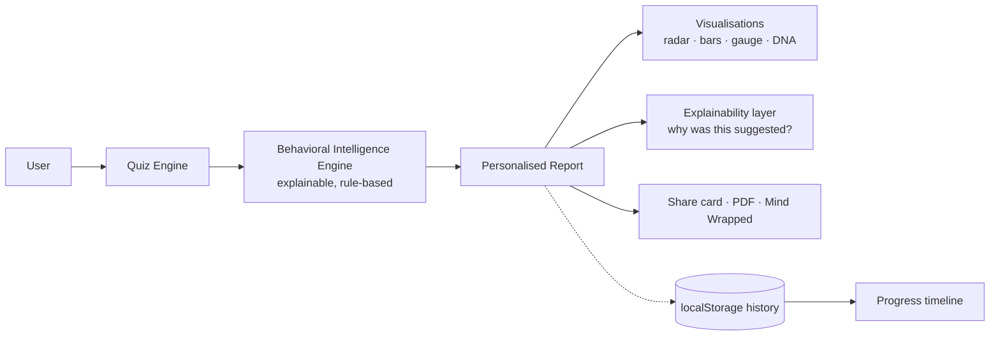

<div align="center">

# 🧠 Decode Your Pattern
### A Personal Intelligence Platform for Self-Reflection and Growth

*Turn a few honest answers into a personalised, explainable map of how you actually operate — then track it over time.*

[](https://antarabarman.github.io/Decode_Your_Pattern/)
[](LICENSE)
[](#tech)
[](docs/DEPLOYMENT.md)

[**▶ Try the live demo**](https://antarabarman.github.io/Decode_Your_Pattern/) · [Architecture](docs/ARCHITECTURE.md) · [Case study](docs/CASE_STUDY.md) · [Explainability](docs/EXPLAINABILITY.md) · [Roadmap](ROADMAP.md)

</div>

---

> ⚠️ **Not a clinical or scientific assessment.** Decode Your Pattern does **not** diagnose personality or
> mental health. Every insight is an *observation derived from your own responses*, offered to encourage
> self-reflection and personal growth — never a fact or a verdict. See [Explainability](docs/EXPLAINABILITY.md).

## ✨ What it does

You answer a set of questions — practical, logical, philosophical, and psychological, plus your real likes,
triggers, and fears — drawn **fresh at random each time**. From *your answers alone*, the platform generates a
report that is unique to you:

| | Feature | Why it matters |
|---|---|---|
| 📊 | **Pattern Score (300–900)** | A single, credit-score-style read of your behavioural history, with honest bands. |
| 🧭 | **10-dimension radar + graded bars** | See where you're strong and where you're stretched, at a glance. |
| 🧠 | **Style insights** | Decision-making, communication, stress, and learning styles — plus hidden potential & blind spots. |
| 🧬 | **Pattern DNA** | A branded signature of all 10 traits — nobody else's reads the same. |
| 🌐 | **Life domains** | The same patterns projected onto Career, Relationships, Health, Money, Learning, Leadership. |
| 💼 | **Recruiter mode** | A professional-competency view — screenshot-ready for a CV or portfolio. |
| 🏅 | **Badges + progress timeline** | Earn badges, then track your Pattern Score across months. |
| ⚠️ | **Scenarios** | Real situations where your weak spots bite — and the move that breaks the loop. |
| 🧰 | **Growth toolkit** | Book, talk, podcast, daily habit, meditation, and app — matched to your weakest areas. |
| 🎁 | **Mind Wrapped + share card** | A Spotify-Wrapped-style summary and a colourful downloadable image to share. |
| 🪞 | **Explainability** | Insights are framed as tendencies, never facts — with the *why* behind them. |

Plus: a clean landing page, generative **focus music**, and **PDF export** — all running
entirely in the browser. No sign-up. No tracking. No data leaves the device.

## 🚀 Quickstart

```bash
# 1. Clone
git clone https://github.com/AntaraBarman/Decode_Your_Pattern.git
cd Decode_Your_Pattern

# 2. Open in a browser — that's it. No build step, no dependencies.
#    macOS:  open index.html
#    Linux:  xdg-open index.html
#    Windows: start index.html
```

Or just **[open the live demo](https://antarabarman.github.io/Decode_Your_Pattern/)**.

## 🗂️ Repository structure

```
.
├── index.html                  # Landing page → "Get my report" opens the assessment
├── decode-your-pattern_6.html  # The assessment + report engine (single-file app)
├── social-preview.png          # Open Graph image for link sharing
├── docs/                       # Architecture, case study, API, schema, deployment
│   ├── ARCHITECTURE.md
│   ├── CASE_STUDY.md
│   ├── EXPLAINABILITY.md
│   ├── DATA_MODEL.md
│   ├── API.md
│   └── DEPLOYMENT.md
├── phase-b/                    # v2 full-stack scaffold (FastAPI backend + tests)
│   └── backend/
├── .github/workflows/ci.yml    # Static checks + backend tests on every push
├── CONTRIBUTING.md · SECURITY.md · CHANGELOG.md · ROADMAP.md · LICENSE
```

## <a name="tech"></a>🛠️ Tech & architecture

**Today (v1 — live, $0, zero-setup):** a dependency-light, single-file web app. Vanilla JS, inline SVG charts,
the Canvas API for the share card, the Web Audio API for generative music, `localStorage` for private
on-device history. The **Behavioral Intelligence Engine** is a modular, explainable, rule-based system —
deliberately designed so it can later be swapped for an ML/LLM service behind the same interface.

**Next (v2 — full-stack, free-tier):** React + TypeScript + Tailwind frontend, FastAPI backend, Postgres/SQLite,
OAuth + guest mode, an LLM-powered AI Coach, and an anonymous analytics dashboard. See
**[ARCHITECTURE.md](docs/ARCHITECTURE.md)** and **[ROADMAP.md](ROADMAP.md)**.



## 🔒 Privacy by design

v1 sends **nothing** to any server — the entire assessment, scoring, and report run locally, and history is
stored only in your browser's `localStorage`. The planned v2 analytics are **aggregate and anonymous only**
(see [SECURITY.md](SECURITY.md) and [Case study → Privacy](docs/CASE_STUDY.md)).

## 🗺️ Roadmap & docs

- **[Architecture](docs/ARCHITECTURE.md)** — system design, diagrams, the v2 full-stack plan
- **[Case study](docs/CASE_STUDY.md)** — problem, product decisions, trade-offs, lessons learned
- **[Explainability](docs/EXPLAINABILITY.md)** — how insights are generated and framed responsibly
- **[Data model](docs/DATA_MODEL.md)** — current schema + planned database ERD
- **[API spec](docs/API.md)** — the v2 FastAPI contract
- **[Deployment](docs/DEPLOYMENT.md)** — how to ship v1 (Pages) and v2 (free tiers) at $0
- **[Roadmap](ROADMAP.md)** · **[Changelog](CHANGELOG.md)** · **[Contributing](CONTRIBUTING.md)**

## 🤝 Contributing

Contributions, ideas, and issues are welcome — see **[CONTRIBUTING.md](CONTRIBUTING.md)**.

## 📄 License

[CC BY-NC 4.0](LICENSE) © 2026 **Antara Barman** — free to use, share, and learn from for non-commercial purposes, with credit. **Selling or commercial use is not permitted.**

<div align="center">
<sub>Built as an open, educational portfolio project. An honest mirror, not a horoscope.</sub>
</div>
