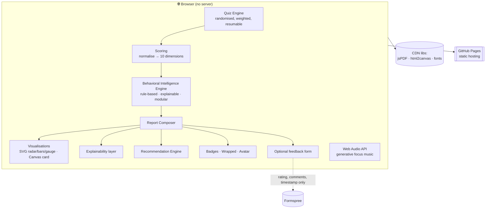
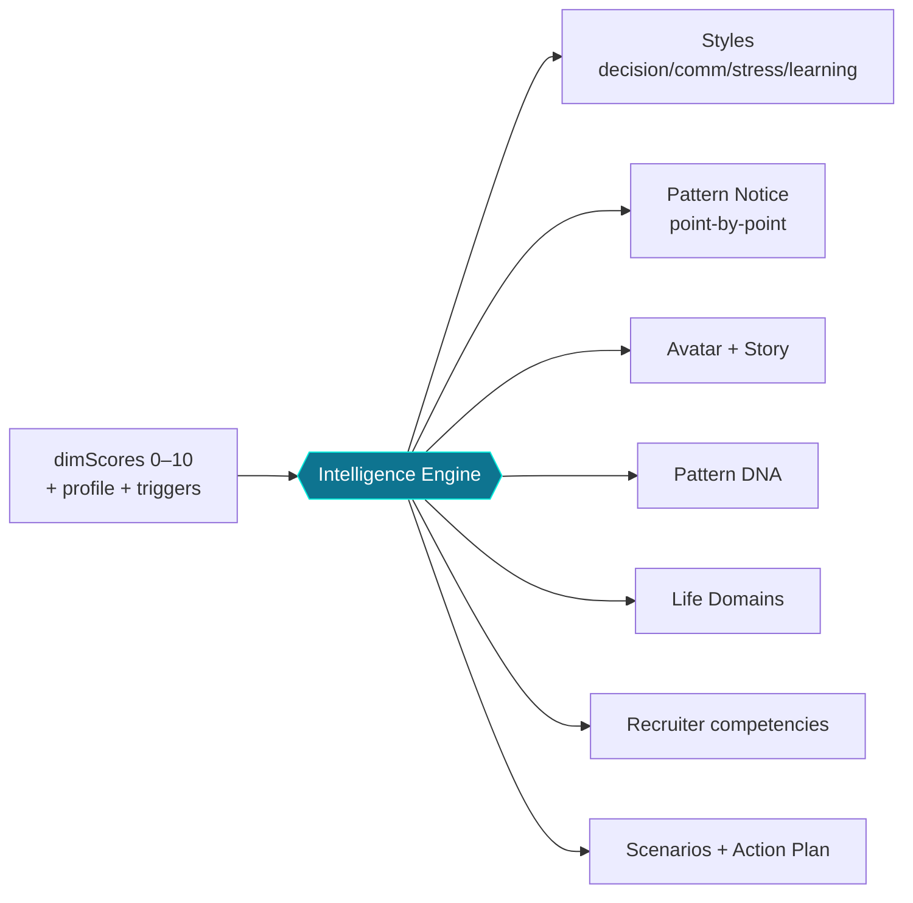
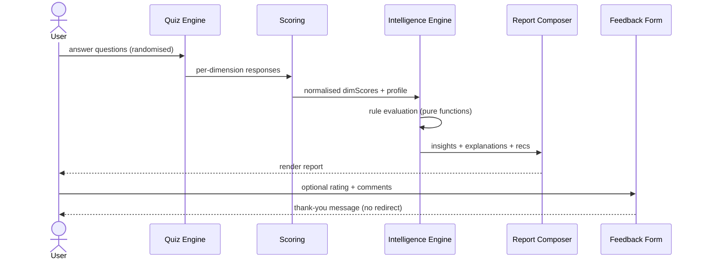
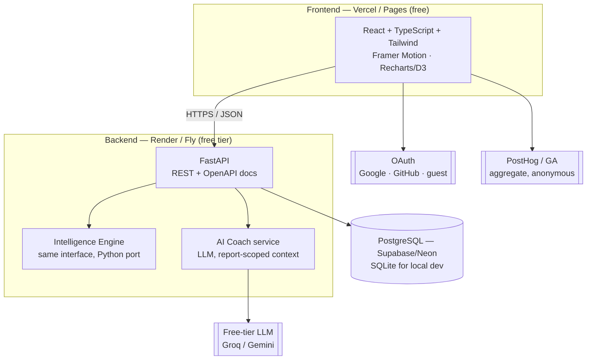

# Architecture

Decode Your Pattern is built in two deliberate phases so it can be **free and live today** while leaving a
clean path to a **full production stack** tomorrow. The boundary between the two is the
*Behavioral Intelligence Engine* interface — everything else can change around it.

- [v1 — the live single-file app](#v1)
- [The Behavioral Intelligence Engine](#engine)
- [Request / report sequence](#sequence)
- [v2 — the planned full-stack platform](#v2)
- [Key design decisions](#decisions)

---

## <a name="v1"></a>v1 — the live single-file app (today, $0, zero-setup)

v1 is intentionally **dependency-light and serverless**. It runs entirely in the browser and deploys as static
files on GitHub Pages. This keeps it free and trivially shareable; the only thing that ever leaves the device
is an optional feedback submission (see below).



**Module map (within `decode-your-pattern_6.html`)**

| Concern | Responsibility |
|---|---|
| Quiz Engine | Question bank + random sampling, weighted scoring functions, progress, branching hooks |
| Scoring | Aggregates per-dimension raw/score, normalises to 0–10 and a 300–900 Pattern Score |
| Behavioral Intelligence Engine | Pure functions: `buildInsights`, `buildPatternPoints`, `buildScenarios`, `buildAvatar`, `buildDNA`, domains, recruiter mapping |
| Recommendation Engine | Maps weakest dimensions → books, talks, podcasts, habits, meditations, apps (each with a *why*) |
| Explainability | Frames every output as a tendency and surfaces the responses that drove it |
| Visualisation | Inline SVG (radar, bars, gauge) + Canvas (colourful share card) |
| Feedback | Optional end-of-report star rating + comments, posted to a third-party form service |

---

## <a name="engine"></a>The Behavioral Intelligence Engine

The engine is the heart of the product and is built as a set of **pure, testable functions** that take a
`dimScores` object and profile inputs and return structured, explainable output. This is the seam that lets v2
swap in ML/LLM scoring **without touching the UI**.



**Interface (conceptual):**

```ts
interface IntelligenceEngine {
  analyze(input: AssessmentInput): Report;        // v1: rules · v2: rules + ML
  explain(insightId: string): Explanation;        // why-this + confidence
}
```

---

## <a name="sequence"></a>Request / report sequence



---

## <a name="v2"></a>v2 — the planned full-stack platform (free-tier)

v2 introduces accounts, persistence across devices, an LLM AI Coach, and an anonymous analytics dashboard —
all deployable on **free tiers** (Vercel + Render + Supabase/Neon + a free LLM key).



**Why this shape stays $0:** static frontend (Pages/Vercel free), a single small FastAPI service on a free
container host, a free managed Postgres, and a free-tier LLM key held **only** server-side (never in the public
repo). See **[DEPLOYMENT.md](DEPLOYMENT.md)**.

---

## <a name="decisions"></a>Key design decisions

| Decision | Rationale | Trade-off |
|---|---|---|
| **Single-file v1** | Zero build, zero cost, instant share, total privacy | Harder to unit-test in isolation; addressed by pure functions + Node test harness |
| **Rule-based engine first** | Explainable, deterministic, free, no key | Less "magic" than an LLM; mitigated by a swappable interface for v2 |
| **`localStorage` for history** | Private by default, no backend needed | Per-device only; v2 accounts add cross-device sync |
| **Inline SVG + Canvas** | No chart library to ship; full control; renders in PDF | More manual code; isolated in render helpers |
| **Randomised question draw** | Replayable, reduces gaming/memorisation | Scores vary slightly run-to-run; documented as a feature, normalised in scoring |
| **Explainability as a first-class layer** | Responsible framing; builds trust | More copy to maintain; centralised in the engine |
