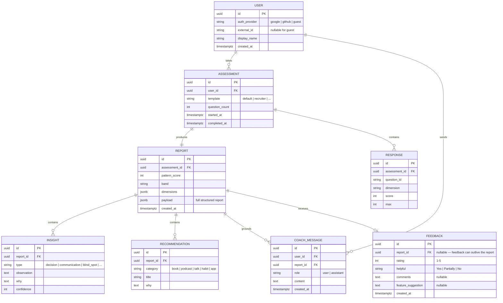

# Data Model

## v1 — on-device (today)

v1 has **no database**. Answers, dimension scores, and the full report live only in memory for the duration
of the session and are never written to disk or sent anywhere.

The one exception is the optional **feedback form** at the end of the report. If submitted, it POSTs a small
JSON payload to a third-party form service (Formspree) and also keeps a local copy in `localStorage` under
`dyp-feedback-backlog` (capped to the latest 50 entries) as a delivery safety net:

```jsonc
// payload sent to Formspree, and mirrored into localStorage["dyp-feedback-backlog"]
{
  "rating": "5",            // 1–5, required
  "helpful": "Yes",         // "Yes" | "Partially" | "No", required
  "comments": "",           // optional free text
  "feature": "",            // optional free text
  "timestamp": "2026-07-01T10:32:00.000Z"
}
```

No name, email, or report content is ever included in the feedback payload.

**In-memory report shape (conceptual):**

```ts
type DimensionKey =
  | 'awareness' | 'action' | 'discipline' | 'resilience' | 'adaptability'
  | 'selftrust' | 'boundaries' | 'patience' | 'clarity' | 'growth';

interface Report {
  patternScore: number;              // 300–900
  band: 'High-friction' | 'Developing' | 'Solid' | 'Strong' | 'Exceptional';
  dimensions: Record<DimensionKey, number>;   // 0–10 each
  archetype: string;
  avatar: { name: string; emoji: string };
  insights: Insight[];               // styles, hidden potential, blind spots
  domains: { name: string; pct: number }[];
  competencies: { name: string; pct: number }[];
  toolkit: Recommendation[];
  actionPlan: { week: string[]; month: string[]; year: string[] };
}
```

## v2 — relational schema (planned, free-tier Postgres / SQLite)



`FEEDBACK` is deliberately its own table with no required link to `USER` — v1 collects it from anonymous
visitors, so `report_id` is nullable and there is no name/email column by design. This still supports
future analytics (average rating over time, helpful-rate trends, common feature requests) via simple
aggregates over `FEEDBACK` alone, without ever needing to identify who submitted it.

**Analytics (aggregate, anonymous):** a separate `daily_metrics` rollup table (date, DAU, completion_rate,
avg_duration, top_strength, top_growth_area, pdf_downloads, return_rate, device_breakdown) populated by a
scheduled job — **never** joined back to individual `USER` or `RESPONSE` rows. See [SECURITY.md](../SECURITY.md).

**Privacy rules baked into the schema**
- Guest users have `external_id = NULL` and no PII.
- `RESPONSE` rows can be purged after the `REPORT` is generated (configurable retention).
- The analytics rollup stores **counts only**, never raw answers or identifiers.
