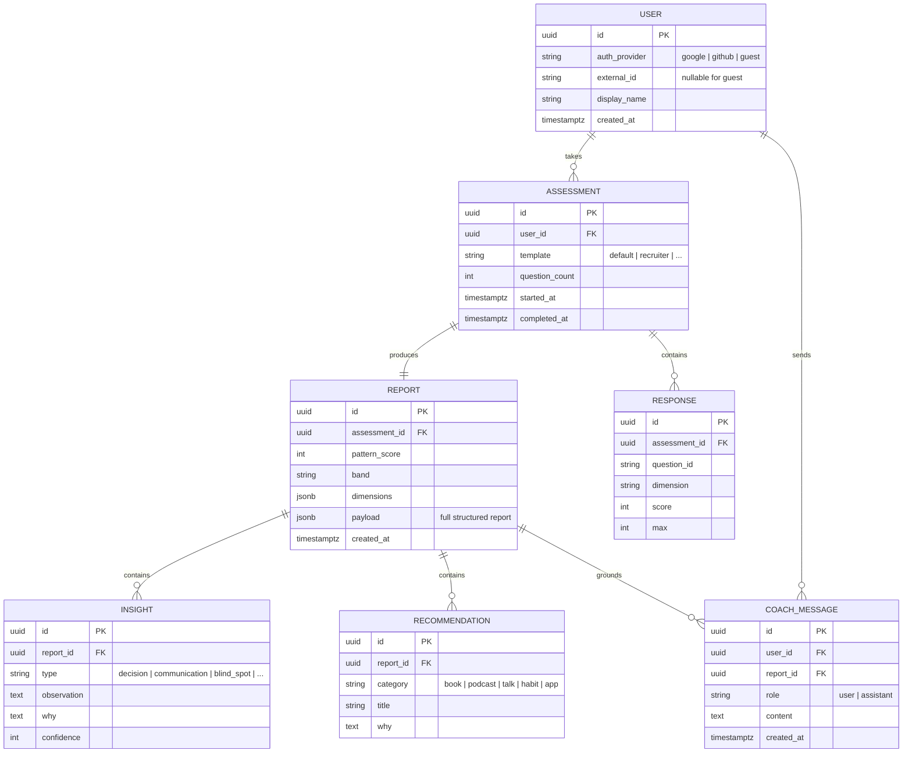

# Data Model

## v1 — on-device (today)

v1 has **no database**. The only persisted data is a private, per-device history used for the progress timeline,
stored in `localStorage` under the key `dyp-history`:

```jsonc
// localStorage["dyp-history"]  (capped to the latest 30 entries)
[
  { "d": 1750000000000, "score": 612 },   // d = epoch ms, score = Pattern Score (300–900)
  { "d": 1752600000000, "score": 655 }
]
```

Everything else (answers, dimension scores, the full report) lives only in memory for the duration of the
session and is never written to disk or sent anywhere.

**In-memory report shape (conceptual):**

```ts
type DimensionKey =
  | 'awareness' | 'action' | 'discipline' | 'resilience' | 'adaptability'
  | 'selftrust' | 'boundaries' | 'patience' | 'clarity' | 'growth';

interface Report {
  patternScore: number;              // 300–900
  band: 'High-friction' | 'Developing' | 'Solid' | 'Strong' | 'Exceptional';
  dimensions: Record<DimensionKey, number>;   // 0–10 each
  archetype: string;
  avatar: { name: string; emoji: string };
  insights: Insight[];               // styles, hidden potential, blind spots
  domains: { name: string; pct: number }[];
  competencies: { name: string; pct: number }[];
  toolkit: Recommendation[];
  actionPlan: { week: string[]; month: string[]; year: string[] };
}
```

## v2 — relational schema (planned, free-tier Postgres / SQLite)



**Analytics (aggregate, anonymous):** a separate `daily_metrics` rollup table (date, DAU, completion_rate,
avg_duration, top_strength, top_growth_area, pdf_downloads, return_rate, device_breakdown) populated by a
scheduled job — **never** joined back to individual `USER` or `RESPONSE` rows. See [SECURITY.md](../SECURITY.md).

**Privacy rules baked into the schema**
- Guest users have `external_id = NULL` and no PII.
- `RESPONSE` rows can be purged after the `REPORT` is generated (configurable retention).
- The analytics rollup stores **counts only**, never raw answers or identifiers.
