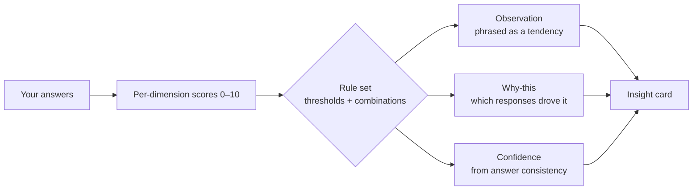

# Explainability & Responsible Framing

Decode Your Pattern is an **explainable** system by design. This document describes how insights are generated,
how they are framed, and the guardrails that keep the product honest.

## 1. The core promise

> Every output is an **observation derived from your own responses**, offered for self-reflection.
> It is **not** a diagnosis, a clinical or scientific assessment, or a statement of fact about who you are.

This is enforced in three places: a persistent banner on the report, the wording of every generated sentence
("tends to", "suggests", "you may"), and this document.

## 2. How an insight is produced

The engine is **rule-based and deterministic**: the same answers always produce the same report. Rules combine
dimension scores (e.g. *high `clarity` + low `resilience` → "logical on the surface, stress sways the final
call"*). No black box, no training data, no hidden profiling.

## 3. "Why was this suggested?"

Recommendations and observations reference the **response patterns** that influenced them — without exposing raw
scoring internals. Examples:

- *Decision style:* "Because you consistently chose to gather outside input before committing…"
- *Toolkit:* a book/podcast/habit is matched to your **two weakest dimensions**, and each item states what it's
  *for* ("for your patience — to build tolerance for slow, invisible progress").
- *Scenarios:* tied explicitly to your lowest-scoring dimensions.

## 4. Confidence indicators

Confidence reflects **internal consistency**, not correctness. When your answers within a dimension agree, the
signal is stronger; when they conflict, the report says so rather than over-claiming. v2 will surface a numeric
confidence per insight (e.g. *"Based on answers 3, 14, 19"*) computed from response variance.

## 5. What we deliberately avoid

- ❌ Clinical or diagnostic language ("you have…", "this means you are…").
- ❌ Deterministic predictions ("you will…"). v2's prediction features are framed as
  *"people with a similar response pattern often prefer…"*.
- ❌ Comparisons that shame. Low scores are stated plainly and constructively, never as failure.
- ❌ Storing or transmitting personal responses (v1 is fully on-device).

## 6. Swappable intelligence

The engine sits behind a stable interface (`analyze` / `explain`). Today it's rules; tomorrow it can blend in
ML or an LLM **without changing how results are framed** — the responsible-framing layer wraps whatever produces
the raw signal. See [ARCHITECTURE.md](ARCHITECTURE.md#engine).

## 7. For the AI Coach (v2)

The planned AI Coach receives **only the user's generated report** as context and is system-prompted to:
encourage reflection, suggest habits and learning strategies, and **explicitly decline** to provide therapy,
diagnosis, or professional (medical/legal/financial) advice — deferring to qualified professionals for those.
